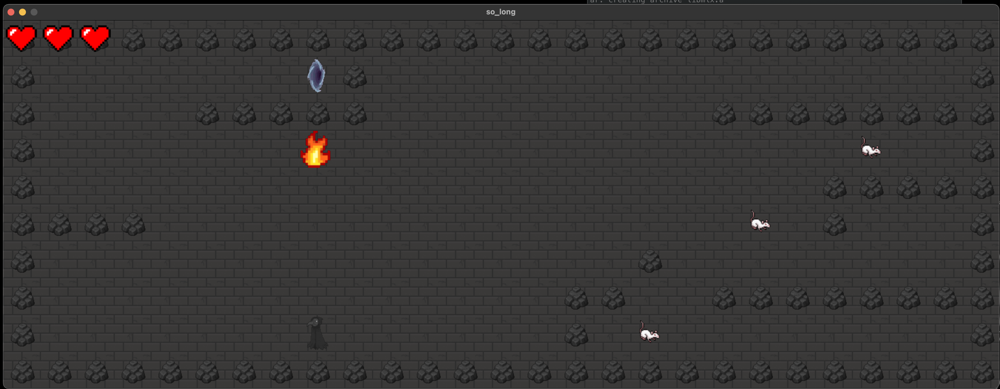

# so_long

## 프로젝트 소개
이 프로젝트의 목표는 입력받은 지도 파일을 기반으로 정상적으로 동작하는 콘솔 게임을 구현하는 것입니다.
<br></br>
이 프로젝트는 다음 프로젝트를 C에서 C++ 기반으로 리펙토링한 결과물입니다.
[원본 프로젝트 링크](https://github.com/eulrho/42seoul-cursus/tree/main/so_long)

## 지도 파일 규칙
### 파일명
확장자명은 ".ber"로 고정
### 구성요소
제시된 문자이외의 문자 사용 금지
#### 벽 (1)
* 지도는 직사각형 모양이며, 모든 테두리가 벽으로 둘러쌓여 있어야 함
* 지도 내부에도 벽에 존재할 수 있음
#### 길 (0)
* 플레이어는 벽이 아닌 모든 곳을 지날 수 있음
* 시작 위치, 수집품, 출구를 제외한 플레이어의 이동 가능한 곳을 길로 간주함
* 지도에 따라서 길이 없을 수도 있음
#### 수집품 (C)
* 플레이어는 모든 수집품을 얻어야만 출구를 통해 나갈 수 있음
* 만약 플레이어가 모든 수집품을 얻을 수 없는 지도라면, 유효하지 않은 지도로 간주함
* 한 수집품은 한 번만 얻을 수 있음
* 수집품의 개수는 한 개 이상이어야 함
#### 출구 (E)
* 출구는 반드시 하나만 존재해야 함
#### 시작 위치 (P)
* 플레이어는 시작 위치에서 게임을 시작할 수 있음
* 시작 위치는 반드시 하나만 존재해야 함

## 지도 예시
```
// map2.ber
11111
10001
1ECP1
11111
```

## 게임 플레이 방법

### 실행
```
> git clone https://github.com/eulrho/so_long.git
> cd so_long
> make
> ./so_long [파일명]
```
### 동작
|키 이벤트|설명|
|---|---|
|방향키 ↑|up|
|방향키 ↓|down|
|방향키 ←|left|
|방향키 →|right|

### 종료 조건
* 플레이어가 모든 수집품을 얻고, 출구에 도달할 경우
* x 버튼을 눌러 창을 닫을 경우
* ESC 키를 누를 경우

## 음원 소스 출처
[무료소리창고-티스토리](https://pgtd.tistory.com/)